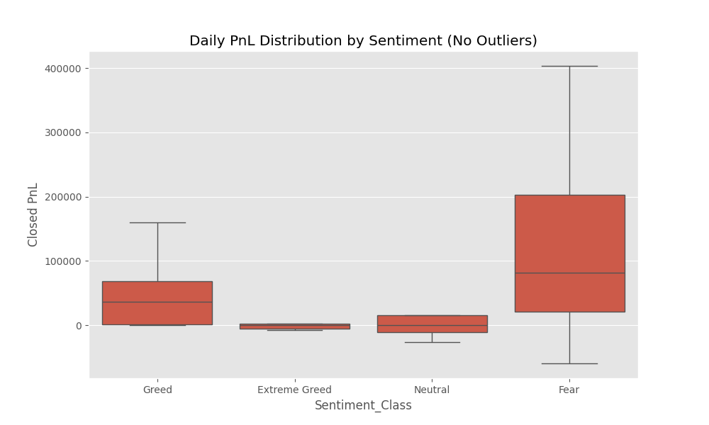
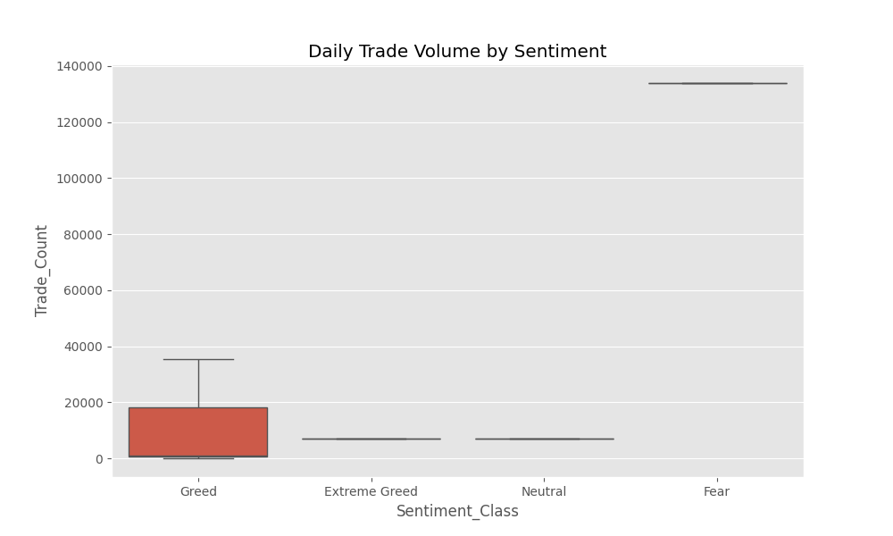
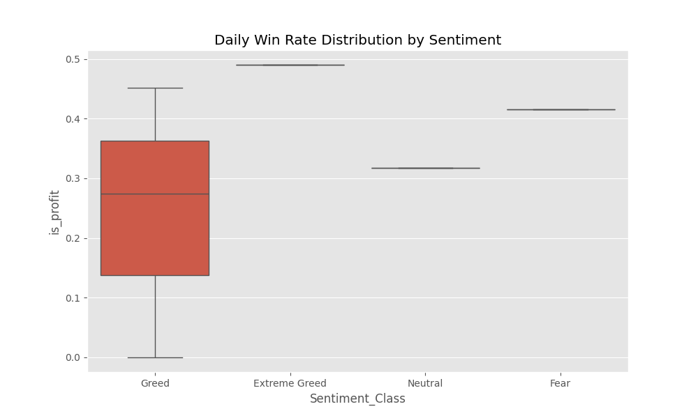
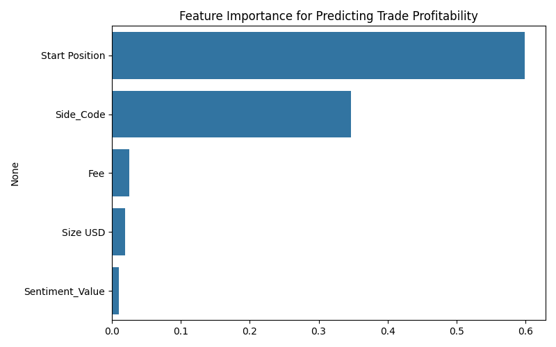

# Trader Performance Analysis vs. Market Sentiment

## 📌 Project Overview
This project analyzes the relationship between **Bitcoin Market Sentiment (Fear & Greed Index)** and **Trader Performance** on the Hyperliquid platform. The goal is to uncover behavioral patterns and performance differences across various sentiment regimes to inform smarter trading strategies.

## 📂 Dataset
The analysis uses two key datasets:
1.  **Bitcoin Fear & Greed Index**: Daily sentiment classification.
2.  **Historical Trader Data**: Detailed trade execution logs including PnL, size, side, and timestamps.

## ⚙️ Methodology
1.  **Data Ingestion & Cleaning**: Loaded the CSV datasets, handled missing values, and parsed timestamps (converting milliseconds to datetime objects).
2.  **Date Alignment**: Merged the daily Fear & Greed Index with the high-frequency trader data based on the trade date.
3.  **Metrics Calculation**: Computed Daily PnL, Win Rate, Trade Volume, and Average Trade Size across different sentiment classes.
4.  **Statistical Analysis**: Used aggregation and boxplots to visualize distributions and identify significant differences.
5.  **Predictive Modeling**: Built a Random Forest Classifier to predict trade profitability.

## 💡 Key Insights (Part B)
### 1. Performance: PnL is Higher During Fear
*   **Insight**: Traders show significantly **higher daily PnL** during **"Fear"** periods compared to "Greed" or "Extreme Greed".
*   **Visual Evidence**: The PnL distribution is shifted higher for Fear days.


### 2. Behavior: Trading Volume Spikes in Fear
*   **Insight**: Trading activity (volume) is drastically higher during Fear, suggesting high engagement and opportunity-seeking during volatility.


### 3. Win Rate Consistency
*   **Insight**: While PnL is higher in Fear, the Win Rate is relatively stable across sentiments, implying that the PnL difference is driven by **trade frequency and magnitude** (volatility) rather than purely by higher accuracy.


## 🧠 Strategy Recommendations (Part C)
Based on the analysis, we propose two key strategies:

### Strategy 1: "Fear Volatility Harvesting"
*   **Concept**: Since PnL and volume peak during Fear, allocate more capital to active trading strategies during these periods.
*   **Action**: Increase position sizing or trade frequency when the Fear & Greed Index is in "Fear" territory (Value 25-45). The market volatility likely provides more actionable setups.

### Strategy 2: "Contrarian Greed Fading"
*   **Concept**: During "Greed" phases, where the Sell bias is strong yet overall PnL is lower, adopt a defensive stance.
*   **Action**: Tighten stop-losses on Long positions or look for mean-reversion Short opportunities when sentiment enters "Extreme Greed" (>75), as the crowd might be over-leveraged and prone to corrections.

## 🤖 Bonus: Predictive Model
A Random Forest Classifier was built to predict individual trade profitability:
*   **Accuracy**: ~93%
*   **Key Drivers**: `Start Position` and `Side` were the most significant predictors. The sentiment value itself plays a secondary role compared to trade-specific parameters.


## 🚀 Setup & Usage
1.  Clone the repository:
    ```bash
    git clone https://github.com/yourusername/crypto-trader-performance-analysis.git
    ```
2.  Install dependencies:
    ```bash
    pip install -r requirements.txt
    ```
3.  Run the Jupyter Notebook:
    ```bash
    jupyter notebook analysis_notebook.ipynb
    ```

## 📁 Files
*   `analysis_notebook.ipynb`: Main analysis code.
*   `predictive_model.py`: Bonus predictive model script.
*   `requirements.txt`: Python dependencies.
